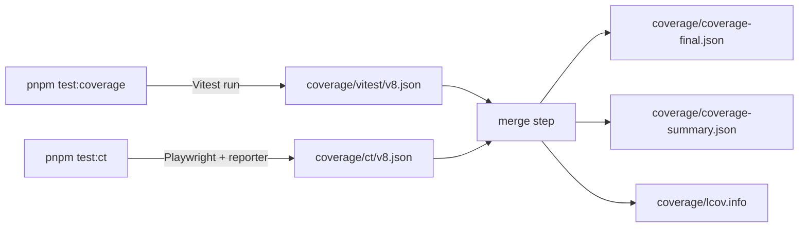

# Feature: Q22 follow-up #3 — `playwright-coverage` integration

> **Status: ✅ RESOLVED (iteration 121, 2026-04-27).** Fully shipped
> across iterations 110-121. Spec authored iteration 110; all six
> implementation phases landed (113 / 114 / 115 / 116 / 117 / 119 /
> 120 / 121 — see `docs/plans/q22-playwright-coverage.md` Phase 0 / 1 /
> 2 / 3 / 6a / 6b / 6c outcome blocks for the per-iteration verification
> numbers, and `docs/architecture/testing-runners.md` "Future work" for
> the consolidated outcome list).
>
> Final per-package merged coverage on `@ever-works/ui` after Q27
> closed in iteration 124: branches **100% (233/233)**, functions
> 100% (104/104), lines 99.76% (1240/1243), statements 99.72%
> (352/353), bytes 99.79% (45,558/45,650) across 19 files. Per-file
> Phase 6c gate: FilterBar **100%** ✅, LayoutSwitcher **100%** ✅,
> MobileMenu **100% (35/35)** ✅ — all three above the 80%-branch
> hard threshold enforced by `packages/ui/scripts/coverage-merge.ts`
> and the `.github/workflows/ci.yml` `coverage-gate` job. The CI
> hard-gate now has zero margin to absorb regressions. Q25, Q26,
> and Q27 all ✅ RESOLVED in their respective entries in
> `docs/questions.md`. (Iteration 121 baseline — preserved for
> archeology — was 98.72% / MobileMenu 91.89%; the 3-branch
> outlier closed in iteration 124 via Q27.)
>
> Tracks the third and final follow-up on the Q22 / Q23 / Q24
> CT-migration arc. Resolved the gap left by iterations 105, 107, and
> 108: three components (`FilterBar`, `LayoutSwitcher`, `MobileMenu`)
> ran only under Playwright CT and were excluded from the Vitest V8
> branch report so the per-package coverage number did not regress.
> This spec's integration captures V8 coverage during BOTH Vitest and
> CT runs and merges them via MCR (Q26 default — `vitest-monocart-
> coverage` adopted iteration 119) — restoring those three components
> to the branch-coverage roll without sacrificing the CT migration's
> correctness gains.

## Description

The Q22 / Q23 / Q24 trilogy migrated three high-risk Preact components
out of Vitest+jsdom and into Playwright Component Testing
(`@playwright/experimental-ct-react`):

| Component                                  | Iteration | CT spec |
|--------------------------------------------|-----------|---------|
| `packages/ui/src/preact/FilterBar.tsx`     | 105       | `q22-playwright-ct.md` |
| `packages/ui/src/preact/LayoutSwitcher.tsx`| 107       | (resolved Q23, see same spec) |
| `packages/ui/src/preact/MobileMenu.tsx`    | 108       | `q22-mobilemenu-ct.md` |

For each migration, the corresponding Vitest test file was deleted and
the source file was added to `packages/ui/vitest.config.ts`'s
`coverage.exclude`. Without that exclusion, the per-package V8 branch
report would have shown ~0% coverage for those three files (Vitest
never executes them anymore — only Playwright does), dragging the
package-level branch number down to roughly 70%. With the exclusion in
place, the report is at 100% for the *measured* surface area, but
**three production components are no longer subject to coverage
gating** in CI.

The CT runs themselves *do* execute those components — Playwright drives
a real Chromium tab through `mount()` and exercises the same code paths
the Vitest harness used to measure. Chromium emits V8 coverage data via
the `Profiler.takePreciseCoverage()` CDP API; with the right reporter
hooked into Playwright, that data can be:

1. Captured per-test from each Chromium tab.
2. Source-mapped back from the dev-server-transformed bundle to the
   original `.tsx` source.
3. Aggregated across all CT tests in a single run.
4. Merged with the Vitest V8 coverage output (V8 JSON →
   `coverage-final.json` Istanbul JSON if needed).
5. Reported alongside the Vitest result so a single number tells the
   true coverage story for `@ever-works/ui`.

## User Stories

- As a **developer**, I want `pnpm test:coverage` to report a single
  branch-coverage number for `@ever-works/ui` that includes
  `FilterBar.tsx`, `LayoutSwitcher.tsx`, and `MobileMenu.tsx` — not just
  the components that happened to stay under Vitest.
- As a **maintainer**, I want CI's coverage gate to fail loud if a CT
  test stops covering a branch in `FilterBar` (for example, after a
  refactor that removes a code path nothing exercises). Today, CI only
  measures the Vitest suite, so a CT-side regression would slip
  through.
- As an **AI agent**, I want a single `coverage/coverage-summary.json`
  file the next iteration can read to validate that no PR landed under
  a coverage drop. Two separate files (one Vitest, one CT) make
  comparison ambiguous.
- As a **future-maintainer**, I want the three exclusions in
  `vitest.config.ts` `coverage.exclude` to drop with a one-line edit
  once the merge story works — not to require a fundamental rewrite.

## Acceptance Criteria

1. **AC #1 — Library installed and pinned.** The chosen coverage
   library (Q25 default: `monocart-coverage-reports`) is added as a
   `devDependency` of `@ever-works/ui` at a pinned semver (^2.x) and
   reflected in `pnpm-lock.yaml`. Q25's resolved choice (or override)
   is recorded in this spec under "Decisions" before any code lands.
2. **AC #2 — Playwright CT config emits V8 coverage.** Running
   `pnpm --filter @ever-works/ui test:ct` produces a per-run V8
   coverage JSON file under `packages/ui/coverage/ct/`
   (one file per Playwright worker, or a single merged file). The
   format is the V8 native shape (`{result: [{url, functions: [...]}, ...]}`).
3. **AC #3 — Source maps land.** The emitted V8 data references
   original source files (`packages/ui/src/preact/FilterBar.tsx`, etc.)
   not the Vite-transformed bundle paths. Verified by inspecting the
   coverage JSON — every `url` should resolve to a `.tsx` under
   `packages/ui/src/`.
4. **AC #4 — Vitest + CT V8 reports merge.** A new `pnpm coverage`
   script (or extension to existing `test:coverage`) runs the Vitest
   coverage pass first, then the CT coverage pass, then merges both
   into a single `coverage/coverage-summary.json` and
   `coverage/coverage-final.json`. The merge respects the pre-existing
   Vitest config (provider: v8, include globs).
5. **AC #5 — `vitest.config.ts` exclusions drop.** The lines
   excluding `src/preact/FilterBar.tsx`, `src/preact/LayoutSwitcher.tsx`,
   and `src/preact/MobileMenu.tsx` are removed from
   `packages/ui/vitest.config.ts`. The merged report shows ≥80% branch
   coverage for each of those three files, sourced entirely from CT
   runs.
6. **AC #6 — Per-package branch coverage at-or-above pre-exclusion
   baseline.** The merged `@ever-works/ui` branch-coverage number is
   ≥ the iteration-95 baseline (16 packages at 100% branch — see
   `docs/log.md` iteration 95). If the merged number is below baseline,
   either the CT suite has gaps or the merge is mis-mapping; both
   conditions block AC #6.
7. **AC #7 — CI integration.** The CI workflow `.github/workflows/ci.yml`
   `test-ct` job uploads its V8 coverage artifact, and the `test`
   coverage job downloads it before running the merge. Both jobs feed
   the same `coverage/` directory so the published artifact contains
   the merged number, not two partial numbers.
8. **AC #8 — Documentation updated.**
   - `docs/architecture/testing-runners.md` "Coverage handling" section
     replaces "CT runs are not measured by V8 at this time" with the
     new merged-pipeline description, and "Future work" loses the
     `playwright-coverage` integration bullet.
   - `docs/architecture/testing-runners.md` "Local commands" gains
     `pnpm coverage` (the merged command) alongside the existing
     `pnpm test:coverage` (Vitest-only).
   - `docs/index.md` iteration descriptor is bumped.
   - `docs/log.md` gets a new iteration entry.
   - `docs/questions.md` Q22 follow-up #3 status flips to ✅ RESOLVED;
     Q25 (library choice) is also resolved with the actual integration
     evidence inline.
9. **AC #9 — Typecheck and lint pass.** `pnpm typecheck` reports 23/23
   successful, 0 errors. `pnpm lint` reports 18/18 successful, 0
   errors.
10. **AC #10 — Existing tests still pass.**
    - Plain `pnpm test` still reports 11/11 files passing in
      `@ever-works/ui` (174 tests).
    - `pnpm test:ct` still reports 48/48 passing (16 FilterBar +
      12 LayoutSwitcher + 20 MobileMenu) — count grew from the iter-110
      AC baseline of 43/43 (15 MobileMenu) via iter-120 focus-trap CT
      additions (15 → 17) and iter-124 Q27 outlier closure (17 → 20);
      MobileMenu growth is recorded inline because this AC was the
      canonical count source at iter-115 / iter-121 verification time
      and is still cited from `.specify/features/testing.md` AC #12.
    - `pnpm test:e2e` is unaffected (out of scope for this work).

## The integration

The merge step is provided by the chosen library:

- **`monocart-coverage-reports`** (Q25 default): native V8 merge via
  `mcr.add(coverageData)` calls. The Playwright CT reporter is invoked
  by adding a `monocart-reporter` entry to
  `packages/ui/playwright.ct.config.ts` `reporter` field. Vitest's V8
  output (`coverage-final.json`) is fed through `mcr.add(...)` as a
  second source. Output is V8-native — same shape Vitest emits — so
  both sources are first-class.
- **`@bgotink/playwright-coverage`** (Q25 alternative): converts V8 to
  Istanbul before merging. Lossier for source-mapped edge cases.
- **Custom harness** (Q25 fallback): wire `Profiler.takePreciseCoverage()`
  manually via Playwright's `addInitScript` + `evaluate`, post-process
  with `c8` or `v8-to-istanbul`. Highest control, highest maintenance
  cost.

## Out of scope

- **Migrating *more* components to CT.** The three already migrated are
  the universe of Q22-shape risks; iteration 110 will not preemptively
  migrate any new component.
- **E2E coverage merge.** `apps/web-e2e` runs Playwright in `test`
  mode, not CT mode, against built bundles. Merging E2E coverage is a
  separate, future feature — likely under a new spec like
  `coverage-e2e.md`.
- **Branch-coverage threshold enforcement.** The current per-package
  threshold (`branch: 100`) lives in `packages/ui/vitest.config.ts`.
  After the exclusions drop, the threshold remains 100; if the merged
  number falls below, the build correctly fails. This spec does NOT
  introduce a separate threshold for the merged number — it relies on
  the existing one.
- **Removing `pnpm test:ui:safe`.** Q22 follow-up #2 is tracked
  separately. The cron-task instruction "Do NOT remove anything (move
  or improve is OK)" precludes outright removal; the script remains as
  a defensive fallback. Iteration 110 will *soft-deprecate* it via a
  doc note (no behavior change).
- **Replacing Vitest with Playwright everywhere.** Vitest still owns
  `keyboard.test.ts`, `pagination.test.ts`, `sort-items.test.ts`,
  `utils.test.ts`, `variants.test.ts`, `back-to-top.test.tsx`,
  `item-browser.test.tsx`, `search-input.test.tsx`,
  `sort-select.test.tsx`, `theme-toggle.test.tsx`, and
  `ui-components.test.tsx` — 11 files, 174 tests. Q22's contract was
  "migrate the Q22-shape risks", not "everything to Playwright".

## Risks

- **R1 — Source-map fidelity.** Vite transforms `.tsx` to ES modules
  before Chromium executes them. The CT coverage tool must apply Vite's
  source maps to map V8 ranges back to original source. If source maps
  are stripped (e.g. in production-style builds), coverage will report
  the bundle path, not the source path.
  **Mitigation**: keep CT runs in dev mode (Vite emits inline source
  maps by default). Add a smoke-test step to the plan that verifies
  the emitted JSON's `url` fields resolve to `.tsx` files.
- **R2 — Merged numbers drift from Vitest's algorithm.** V8 coverage
  is byte-precise; Istanbul is line-precise. Different libraries
  reconcile the two differently, which can shift the per-package
  number by 1-3 percentage points.
  **Mitigation**: Q25 default (`monocart-coverage-reports`) emits V8
  natively, matching Vitest's existing provider. The risk is largely
  theoretical for our setup but worth a verification line in the plan.
- **R3 — CI artifact handoff.** GitHub Actions's `actions/upload-artifact`
  → `actions/download-artifact` round-trip can drop large coverage
  files (>100 MB) on slow runners. Our coverage size is small (a few
  hundred KB), but the upload/download step adds a few seconds of
  overhead.
  **Mitigation**: set a hard timeout on the merge step; if it exceeds
  60 s on a green run, investigate.
- **R4 — Library version churn.** `monocart-coverage-reports` is at
  2.12.11 (verified iteration 112); `@bgotink/playwright-coverage` is
  less actively maintained. Both have potential to break with Node 26
  (Q4 2026 expected). **Iteration 117 update**: Phase 6 (Q26) adds
  `vitest-monocart-coverage@^4.0.0` to the dep tree, which is by the
  **same maintainer** (`cenfun`) as `monocart-coverage-reports` and
  `monocart-reporter`. All three packages move in lock-step under one
  author; coordinated upgrades are easier to track than independent
  packages.
  **Mitigation**: pin major version on each (`^2.x.x` for monocart-
  coverage-reports, `^2.x.x` for monocart-reporter, `^4.0.0` for
  vitest-monocart-coverage); subscribe to upstream advisories via the
  existing dep-bump cadence (`docs/log.md` iterations 92, 97, 108
  all bumped UI deps).
- **R5 — Test-volume scaling.** As more components migrate to CT, the
  V8 coverage JSON grows linearly. At 1000+ tests, the merge step may
  hit memory pressure on standard runners.
  **Mitigation**: not a near-term concern (43 tests today), but flag
  it in the plan's "Future work" section.
- **R6 — Q25 default chosen wrong.** ~~If `monocart-coverage-reports`
  turns out to mis-handle Preact's `preact/compat` alias and emits
  zero coverage for those three files, the spec's AC #6 fails.~~
  **DOWNGRADED in iteration 113 (Phase 0 PASS-API)**. The library
  itself works correctly on Windows + Node 24 + Chromium 147; one V8
  entry produced for a synthetic 3-branch test, MCR `add()` +
  `generate()` both succeed, output report carries every field the
  plan's Phase 1 step 2 needs (`url`, `sourcePath`, `source`, `data`,
  `summary`). The remaining sub-risk is whether the
  `react`→`preact/compat` alias produces source-maps that map back to
  `.tsx` files vs. chunk hashes — that is a Phase 1 concern, surfaces
  on the first `pnpm test:ct` run after the reporter is wired, and if
  it fails the fallback is unchanged: swap to
  `@bgotink/playwright-coverage` per Q25 Option B.

## Dependencies

- One new npm devDep: the chosen coverage library.
- No new env vars.
- No new CI jobs (the existing `test` and `test-ct` jobs gain
  upload/download steps).
- Pre-requisite: Q22, Q23, Q24 must remain ✅ RESOLVED. If any of
  those reopen during the implementation, this spec freezes until
  they re-resolve — coverage merging on top of a flaky CT signal
  would mask real regressions.

## Decisions

> Filled in at execution time. Until then, defaults are the authority.

| Decision                                  | Default       | Actual (post-execution) |
|-------------------------------------------|---------------|--------------------------|
| Q25 library choice                        | `monocart-coverage-reports` | **`monocart-coverage-reports@^2.12.0`** ✅ ADOPTED — installed iteration 114 as `@ever-works/ui` devDep; Phase 0 + Phase 1 both PASS empirically. |
| Library validation date                   | _n/a_         | **2026-04-27 (iteration 112)** npm registry + README; **2026-04-27 (iteration 113)** Phase 0 PASS-API; **2026-04-27 (iteration 114)** Phase 1 DONE — all empirical gates green. |
| Companion Playwright reporter             | `monocart-reporter@^2.x.x` | **`monocart-reporter@^2.10.0`** ✅ ADOPTED — installed iteration 114; reporter wired into `playwright.ct.config.ts`. |
| CT coverage output dir                    | `packages/ui/coverage/ct/` | **`packages/ui/coverage/ct/`** ✅ implemented iteration 114 — same as default. |
| Merge command                             | `pnpm coverage` (new) | **✅ ADOPTED iteration 116** — root + per-package script; `packages/ui/scripts/coverage-merge.ts` wraps `monocart-coverage-reports` `inputDir: ['./coverage/raw', './coverage/ct/raw']`. Phase 6c (iteration 121) flipped the per-file gate to `process.exit(1)`. |
| Threshold for merged number               | inherited from `vitest.config.ts` (`branch: 100`) | **✅ ENFORCED iteration 121** — `GATE_THRESHOLD = 80` (named constant in `coverage-merge.ts`) for the three CT-migrated components (`GATE_TARGETS` allow-list); aggregate merged number was 98.72% branches (232/235) at iteration 121 baseline; rose to **100% (233/233)** in iteration 124 after Q27 closed the 3-branch outlier (CI hard-gate now has zero margin). |
| CI artifact name                          | `ui-coverage-ct` | **✅ DEPLOYED iteration 121** as `ui-coverage-merged` — uploaded `if: always()` from the new `coverage-gate` job (`.github/workflows/ci.yml`) for 14-day retention. The CT-only artifact name was superseded by the merged artifact since `coverage-gate` runs the full `pnpm coverage`. |
| `vitest.config.ts` exclusions removed?    | yes (AC #5) | _pending Phase 2_ |
| Reporter formats                          | `['v8', 'lcov', 'codecov']` | **`['v8', 'v8-json', 'console-summary']`** ✅ for the CT-only stage (Phase 1) — `lcov`/`codecov` deferred to Phase 3's merged-report stage where they're more useful (per-file Istanbul output is more useful for the merged report than for the per-CT-run report). The Phase 1 set includes `v8` (HTML), `v8-json` (`coverage-report.json`), and `console-summary` (stdout); the V8-shape `raw-v8.json` is written via a `coverage.onEnd` hook (see plan Phase 1 outcome notes). |
| `entryFilter` regex                       | `src/preact/*.tsx` + `src/primitives/*.tsx` | **`/\/assets\/[^/?]+\.js(?:\?\|$)/`** — the V8 layer sees Vite-bundled chunk URLs (`http://localhost:3100/assets/<name>-<hash>.js`), not source-file URLs. The plan's per-source narrowing happens in `sourceFilter` after source-maps are applied, not in `entryFilter`. |
| `sourceFilter`                            | `**/packages/ui/src/**` | **`packages/ui/src/` OR `src/`-prefixed**, excluding `__tests__/`, `playwright/index.*`, `node_modules/` — matches the workspace-relative paths monocart emits after source-map resolution. |
| Auto-coverage fixture                     | _not in spec_ | **`packages/ui/src/__tests__/ct/fixtures.ts`** ✅ added iteration 114 — extends the `@playwright/experimental-ct-react` `test` with an auto-fixture that wraps every test body with `page.coverage.startJSCoverage()` + `stopJSCoverage()` and pipes the V8 list into `addCoverageReport()`. Without this fixture, `monocart-reporter` would emit zero coverage — the reporter does not auto-instrument `page.coverage`. The three existing CT test files were updated to import `test`/`expect` from `./fixtures` instead of `@playwright/experimental-ct-react` directly. |
| Q26 library (Vitest provider, Phase 6)    | `vitest-monocart-coverage@^4.0.0` (added iteration 117) | **`vitest-monocart-coverage@^4.0.0`** ✅ ADOPTED iteration 119 (resolved `4.0.2`; smoke-tested iteration 117; real adoption iteration 119 with merged report at branches 94.89% / functions 100% / lines 98.63% / statements 96.62% across 19 files). Phase 6a + 6b both ✅. |
| Q26 `mcr.config.ts` filename (Phase 6b)   | `packages/ui/mcr.config.ts` | ✅ created iteration 119 — TypeScript per AGENTS.md R6, ~50 lines including doc block. |
| Q26 `mcr.config.ts` `reports` key         | top-level `outputDir: './coverage'` + `reports: ['raw']` | ✅ deployed iteration 119 — **delta vs. original plan**: the planned `[['raw', { outputDir: './coverage/raw' }]]` per-report-tuple form nests under MCR's default `./coverage-reports/` global root; the deployed top-level form mirrors `playwright.ct.config.ts` and writes to `./coverage/raw/coverage-<id>.json` directly (40 files per Vitest run). |
| Q26 `monocart-coverage-reports` floor bump| `^2.12.0` → `^2.12.9` | ✅ deployed iteration 119 — pin bumped in `packages/ui/package.json`; lockfile resolves to `2.12.11` (current `latest`). |

## References

- `.specify/features/q22-playwright-ct.md` — original Q22 spec; Step 6
  ("CI verification") was kept observation-only, this spec extends it.
- `.specify/features/q22-mobilemenu-ct.md` — Q22 follow-up #1 spec;
  iteration 108 added MobileMenu to the exclusion list.
- `.specify/features/q24-layoutswitcher-empty-modes.md` — Q24 spec;
  iteration 109 fixed the `EMPTY_MODES` race that made CT runs
  deterministic enough for coverage measurement to be meaningful.
- `docs/architecture/testing-runners.md` — current "Coverage handling"
  language that this spec changes.
- `packages/ui/vitest.config.ts` — current exclusion list at lines
  47-53.
- [`monocart-coverage-reports`](https://github.com/cenfun/monocart-coverage-reports)
  — Q25 default, supports `playwright-ct-react` natively.
- [`@bgotink/playwright-coverage`](https://github.com/bgotink/playwright-coverage)
  — Q25 alternative; older but still maintained.
- [`v8-to-istanbul`](https://github.com/istanbuljs/v8-to-istanbul) —
  underlying transform used by both libraries.
- [`vitest-monocart-coverage`](https://github.com/cenfun/vitest-monocart-coverage)
  — Q26 default (added iteration 117); custom Vitest coverage
  provider that wraps `@vitest/coverage-v8` and writes raw V8
  entries to a configured `outputDir`. Same maintainer (`cenfun`) as
  `monocart-coverage-reports`; npm `latest@4.0.2`; MIT.

## AGENTS.md cross-check (R1–R15)

- **R1 (TypeScript only):** all new files under
  `packages/ui/scripts/` and `packages/ui/coverage.config.ts` will be
  `.ts` / `.cts`; no JS/Python.
- **R2 / R3 / R4 (no DB / auth / payments):** N/A. Coverage data is
  filesystem-only.
- **R5 (ISR by default):** N/A. Build behavior unchanged.
- **R6 (Plugin everything):** the coverage merge tool is a build-time
  helper, not a runtime feature; no plugin contract is touched. The
  spec preserves the Q22 plugin-architecture neutrality.
- **R7 (Git-first data):** N/A. Coverage outputs are .gitignored
  artifacts.
- **R8 (Extreme performance):** the merge step adds ≤30 s to a full
  coverage run. Not on the critical path for `pnpm dev` / `pnpm build`
  / `pnpm test`. Impact is contained to `pnpm coverage` (opt-in).
- **R9 (Modular & replaceable):** the chosen library is swappable. The
  merge command lives in a single config file; switching to a
  different tool is a one-file change.
- **R10 (AI-optimized):** the merge config carries inline JSDoc
  pointing at this spec and at Q25. The new `pnpm coverage` script
  has a one-line description in `CLAUDE.md` "Common Commands".
- **R11 (Convention over configuration):** the merge defaults match
  Vitest's existing layout (`coverage/coverage-final.json`,
  `coverage/coverage-summary.json`). No new convention introduced.
- **R12 (Monorepo structure):** all changes live under
  `packages/ui/` plus root `package.json` (one new script line) plus
  `.github/workflows/ci.yml` (artifact handoff).
- **R13 (Exhaustive documentation):** spec + plan + log entry +
  questions.md Q25 + index.md descriptor + testing-runners.md edits.
- **R14 (Convention):** the merge output names mirror Vitest's
  conventions exactly (`coverage-final.json`, `coverage-summary.json`,
  `lcov.info`).
- **R15 (Replace, don't remove):** the three exclusion lines in
  `vitest.config.ts` are REPLACED by a comment pointing at this spec
  and at the merged report. Public behavior — the per-package coverage
  number — IMPROVES (rises from "100% of measured surface" to "100%
  of full surface"). The pre-existing `test:coverage` script is kept;
  `pnpm coverage` is added alongside it.
